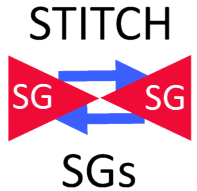

## How to Use Jinja template to Create SG Rules 

### Sample Stack input file for creating SG Rules 
```yaml
common:
  UAI: uai3064620
  ENV: dev
  VPCALIAS: us1n
  SSO: 204056024
  APPNAME: 'venu'
  APP_INSTANCE: 'abc'
  AWS_ACCOUNT: 'cto-architecture-sandbox'


#Python script will replace the values for uai, env and Builder
stack_defaults:
  tags:
    uai: uai3064620
    env: dev
    Builder: vn-builder
    Life: good

region_aliases:
  us1: us-east-1

stacks:
  us1:

    # **************************************
    # create db security groups
    # ************************************** 

    db-sg:
      template: ../AWS-Patterns/sg/sg.cf.yml
      params:
        UAI: { "common": "UAI" }
        AppInstance: dbsg
        Env: { "common": "ENV" }
        VPCAlias: { "common": "VPCALIAS" }
        Role: sg2
        AppName: { "common": "APPNAME" }

    ec2-1:
      template: ../AWS-Patterns/sg/sg.cf.yml
      params:
        UAI: { "common": "UAI" }
        AppInstance: dbsg
        Env: { "common": "ENV" }
        VPCAlias: { "common": "VPCALIAS" }
        Role: sg2
        AppName: { "common": "APPNAME" }
    
    lb-sg:
      template: ../AWS-Patterns/sg/sg.cf.yml
      params:
        UAI: { "common": "UAI" }
        AppInstance: dbsg
        Env: { "common": "ENV" }
        VPCAlias: { "common": "VPCALIAS" }
        Role: sg2
        AppName: { "common": "APPNAME" }    

    # **************************************
    # Stitch security groups
    # ************************************** 
   # create several inbound/outbound rules in db-sg & lambda-sg with one stack
    stitchsgs:
      template: ../AWS-Patterns/sg/sg-rules.cf-j2.yml
      jinjaparams:
        SGRules:
          # stitch lb and ec2
          - SourceSG: 
              stack_output: lb-sg/SGId    # source (egress)
            TargetSG: 
              stack_output: ec2-1/SGId    # destination - ingress
            Rules:
              - Port: '8080'
                Protocol: tcp
                Description: "allow traffic between lb and ec2"

      # Egress for lambda map
          - TargetSG: 
              stack_output: lb-sg/SGId    
            SourceCIDR: '0.0.0.0/0'
            Rules:
              - Protocol: '-1'
                Description: "Outbound for ALB"
          # Ingress for lambda map
          - TargetSG: 
              stack_output: lb-sg/SGId    
            SourceCIDR: '10.244.26.0/24' #Local VPC CIDR need to change to LB sg
            Rules:
              - Port: '443'
                Protocol: tcp
                Description: "Inbound rule for lambda map"
          # stitch lambda and rds
          - SourceSG: 
              stack_output: ec2-1/SGId    # source (egress)
            TargetSG: 
              stack_output: db-sg/SGId    # destination - ingress
            Rules:
              - Port: '2483 - 2843'
                Protocol: tcp
                Description: "allow traffic between lambda and rds"

```

---
layout: default
title:  Stitch Security Groups
date: 2020-04-28
tags:
- Managed Cloud
- Builder
- SG
---


<!--  -->

## Cross Stitch Security Groups

This component modifies existing SGs to allow 
- cross-traffic between 2 SGs   
- adds ingress rule or egress rule to  existing SGs

## Inputs
**jinjaparams:**  see [example](#jinjaparams-example) below
 * **SGRules**: (required) Specify Array of objects SGrules, each object can have the following properties:
   * **SourceSG:**:  (optional) Source SG , it will add Egress Rules to the SG, It can be SG ID or  output of another stack in same infra files.  
   * **TargetSG:**:  (optional) TargetSG SG , it will add Ingress Rules to the SG,It can be SG ID or output of another stack in same infra files
   * **TargetCIDR:** :(optional) It will target to the Ingress Rule, Target CIDR  can be import value from stack exports
   * **SourceCIDR:** :(optional) It will source to the Egress Rule, Source CIDR  can be import value from stack exports
   * **Rules:** :(required) Specify Array of objects rules, each object can have the following  properties
     - **Port:** :(required) Specify port or port range , single port must be an integer. <br> port range must be in the format `<from port>-<to port>` Example 80, 8182, 8000-8010
     - **Description:** :(required) Description of the rule
     - **Protocol:** : default it will be `tcp` otherwise specify `udp` or `icmp`

### Jinja input CONSTRAINTS
1. At least a **SourceSG** or a **TargetSG** must be specified
2. At least a **SourceSG** or a **SourceCIDR** must be specified
3. At least a **TargetSG** or a **TargetCIDR** must be specified
4. If a **SourceSG:** and a **SourceCIDR** is provided we will ignore **SourceCIDR:**
5. If a **TargetSG:** and a **TargetCIDR** is provided we will ignore **SourceCIDR:**

If **SourceSG** is specified it will create egress (outbound) rules in that SG

If **TargetSG** is specified it will create ingress (inbound) rules in that SG

## Outputs

None

## Uses

* Every pattern will use this component to 'stitch' the different 'tiers' of the application. For example db and app.

## Terminology

* Ingress = Inbound
* Egress = Outbound

### jinjaparams example

```yaml
      jinjaparams:
        SGRules:
          - SourceSG:
               stack_output: sg1/SGId    # source (egress)
            TargetSG:
               stack_output: sg2/SGId    # destination - ingress
            Rules:
              - Port: '80'
                #Protocol: tcp
                Description: "Cross-stitch sg1-egress and sg2-ingress on port 80"

          - SourceSG: sg-dfergesd2sa4    # source (egress)
            TargetCIDR: 10.0.0.0/26     # destination - ingress
            Rules:
              - Port: '8080'
                Protocol: tcp
                Description: "egress rule in sg1 to 8080/tcp CIDR 10.0.0.0/26"

              - Port: '8433'
                Protocol: tcp
                Description: "egress rule in sg1 to 8443/tcp CIDR 10.0.0.0/26"

          - TargetSG:
              stack_output: sg1/SGId    # destination - ingress
            SourceCIDR: '10.10.10.10/31'
            Rules:
              - Port: '1812'
                Protocol: udp
                Description: "ingress rule in sg1 from CIDR 10.10.10.10/31"

          - TargetSG:
              stack_output: sg1/SGId    # destination - ingress
            SourceCIDR:
              ImportValue: 'vpc:us1n:app-subnets:cidr'
            Rules:
              - Port: '8000-8012'
                #Protocol: tcp
                Description: "ingress rule in sg1 from Import app-subnets"
```
