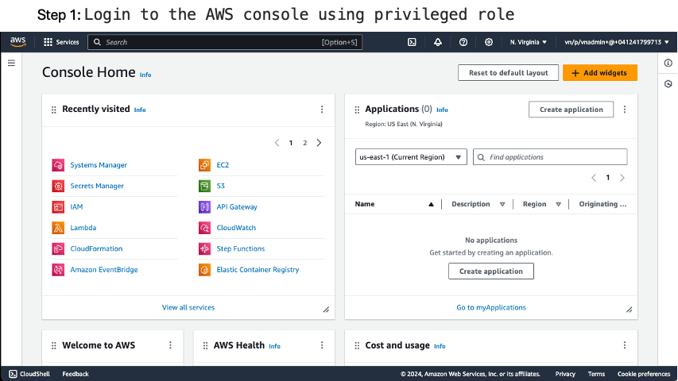

# Purpose
This readme is meant to be used a stepwise guide to get started with creating AWS infrastructure in LZ 1.0 AWS accounts. The example uses a standalone EC2 instance to walkthrough the process of creating a resource in the cloud architecture sandbox, and more useful tips and how-to's will be added as more types of resources are built and test from [AWS Patterns](https://github.build.ge.com/vernova-cloud-iac/AWS-Patterns)


## Step 1

Clone your application repository

```bash
git clone https://github.build.ge.com/vernova-cloud-iac/architect-sandbox-<lastname>-<firstname>

```

## Step 2

Create a feature branch

```bash
# Change to the application directory
cd architect-sandbox-<lastname>-<firstname>
# Create a local branch
git checkout -b <feature-branch-name>

```

## Step 3

	a. Copy `ec2_sso_dev.yml` from the samples folder into parameters folder in your branch.
	   Rename File `ec2_sso_dev.yml` to `ec2_<your-SSO>_dev.yml` (We are doing this to avoid conflicts in cloudformation stack name)
	   Modify `AppName` to a unique name so that you can easily recognoze it in the console
	   You can leave the remaining parameters intact for the first attempt and try to change it later.

	b. Now Modify following key's value into `manifest.yml`
		- name: cloud-architect-sandbox  (Its AWS Account Name, Need to make sure we should have repo with this name as well)
		- account_id: 891377304455
		- pattern-release: release1.3.1 (For latest tag check here : https://github.build.ge.com/vernova-cloud-iac/AWS-Patterns/tags)

	c. Copy `stack_master_dev.yml` from the samples folder into root in your branch.
	   Uncomment commented lines to create ec2 app.
	   Modify `ec2_dev` to `ec2_<your-SSO>_dev.yml` (Filename and value must match)
	


## Step 4

Commit and push the branch to github.

```bash
# add the parameter file
git add parameters/ec2_<sso>_dev.yml
git add stack_master_dev.yml
git add manifest.yml
# commit your changes
git commit -am "Initial commit"
# push the changes to github
git push -u origin <feature-branch-name>

```

## Step 5: Create PR to the dev branch, Review Approve and Merge

1. Login to your repository in github.build.ge.com
2. Create a PR to the dev branch
3. Wait for all checks to pass
4. Wait for an architect to approve the changes
5. Merge changes into dev branch


Merging the changes triggers a Github action that sets off the build process. This process can be tracked in the "Actions" section under "All workflows"

Once build is complete, the pull request details the WIZ scan summary along with the instance ID of the EC2 that was created


## Step 6: Configure LDAP

1. Login to the AWS console using privileged role
2. Go to SSM
3. Select documents under shared resource in left menu 
4. Select shared with me in the top menu
5. Search for `VN-LDAP-Linux`
4. Click run command
5. Pick select instances manually and select your instance
6. Scroll down and run
7. Wait for it to complete



## Step 7: Login to the Server

1. Login to non-prod bastion
> [!Note]  
> Tou must be a member of `CA_AWSENTC_NC_CA_NRGPOWR_NC_AWS_DEVBASTION` in order to access the server
2. Login to the server
> [!Note]  
> Tou must be a member of `CA_CRP_NC_AWS_VN_SA_ADMIN` in order to access the server

## Step 8: Next steps

In normal infra build process you will need to configure application team netgroup and provide acces to application team.

In the sandbox, we would recommend you to go to cloudformation and delete the stack.