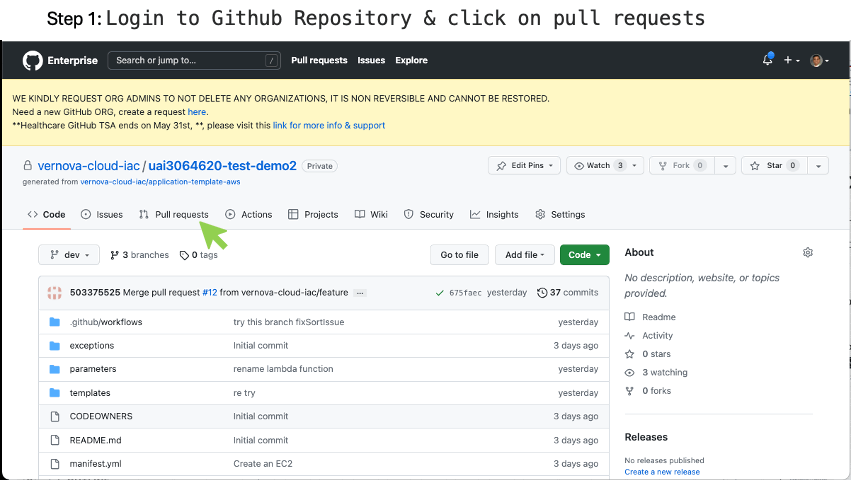

# Azure Linux VM Creation

This document will walkthrough the steps in creating, configuring and accessing a Linux VM in Azure sandbox

## Step 1

Clone you application repository

```bash
git clone https://github.build.ge.com/vernova-cloud-iac/architect-sandbox-<lastname>-<firstname>

```

## Step 2

Create a feature branch

```bash
# Change to the application directory
cd architect-sandbox-<lastname>-<firstname>
# Create a local branch
git checkout -b <feature-branch-name>

```

## Step 3

Copy `main.tf`, `backend.tf`, `variables.tf`, and `main.auto.tfvars` from the samples folder into the dev folder in your branch.

Modify `appName` in `main.auto.tfvars` to a unique name so that you can easily recognoze it in the console

You can leave the remaining parameters intact for the first attempt and try to change it later.

## Step 4

Commit and push the branch to github.

```bash
# add the updated files 
git add .
# commit your changes
git commit -am "Updated required input files <name of files>."
# push the changes to github
git push -u origin <feature-branch-name>

```

## Step 5: Create PR to the dev branch, Review Approve and Merge

1. Login to your repository in github.build.ge.com
2. Create a PR to the dev branch
3. Wait for all checks to pass in the github actions tab
4. Validate the wiz sacan report and make sure there is no critical/high vulnerability.
5. Wait for an architect to approve the changes 
6. Merge changes into dev branch
7. Validate resource status in the subscription.




## Step 7: Login to the Server

1. Login to non-prod bastion server (IP: 10.155.150.199) 
> [!Note]  
> You must be a member of `CA_NRG_AWS_GPOPS_BASTION` in order to access the server
2. Login to the server through bastion
> [!Note]  
> You must be a member of Windows Netgroup in order to access the server

Please refer the link for bastion host details https://devcloud.swcoe.ge.com/devspace/pages/viewpage.action?spaceKey=VUAEZ&title=Accounts

## Step 8: Next steps

In normal infra build process you will need to configure application team netgroup and provide acces to application team.

In the sanbox, we would reccommend you to goto cloudformation and delete the stack.
