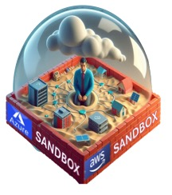
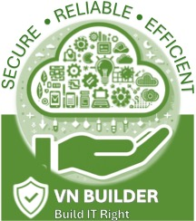
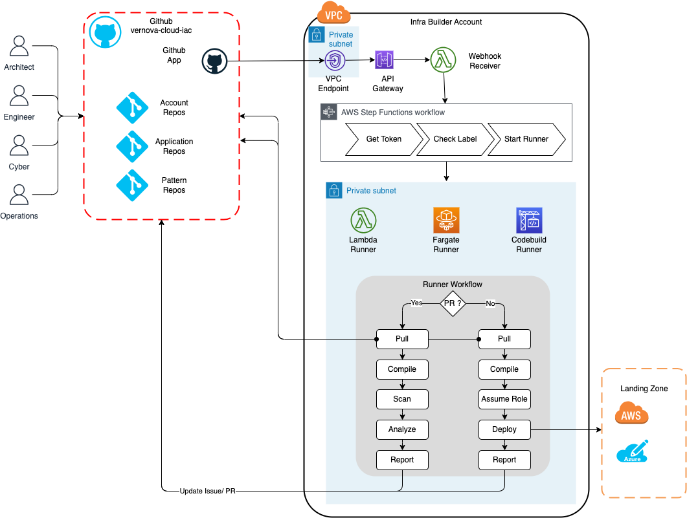

# Cloud Architect Sandbox

## Introduction

Cloud Architect sandbox is provided to enable Vernova architects to learn and practice use of baseline AWS templates and Azure modules to deploy infrastructure as code into Landing Zone 1.0

> ## :fire: [ CAUTION ]  
> No GE data should be used or uploaded to sandbox account and subscriptions

> ## :warning: [ WARNING ]
> Resources in the sandbox accounts and subscriptions will be cleaned up at 8 PM EST everyday

## Key Terms

**AWS Patterns** : These are the approved baseline templates provided in the VN Builder [repositories](https://github.build.ge.com/vernova-cloud-iac/AWS-Patterns)

**Azure Modules** : These are the approved baseline Azure modules provided in the VN Builder [repositories](https://github.build.ge.com/vernova-cloud-iac/Azure-Patterns)

**VN Builder** : A CI/CD toolset to enable infrastructure as code deployments into Landing Zone 1.0. [Architecture]()

**AWS Sandbox** : Alias: `cto-architecture-sandbox`, Id: `891377304455`

**Azure Sandbox** : Alias: `2013-cto-architecture-sandbox`, Id: `9fd8d0ba-5d07-45b2-84e6-1c85cc79832d`

## Before you begin
Consider your local IDE environment, VS Code is a good starting point to setup a local environment to work with the Github. You can use this [Tutorial](https://www.youtube.com/watch?v=i_23KUAEtUM) to setup VS Code to work with Git on the repositories you have been working with.

## Components
The current infra builder setup works primarily with the three files:

1. manifest.yml- This file has details on the AWS account in use, account number and the infra template release version. In an ideal production build scenario. this file must not be changed/edited.
2. ec2_dev.yml- In the AWS sample for this repo, the file is named as ec2_dev.yml, but for a different resource it will be different. This file has the main configuration and tagging for the resource being built.
3. stack_master_dev.yml- This file has the actual redirection for stacks to look up the CFT template to build the resources that need to be built (in the base AWS EC2 example, it is ec2.cf.yml)

## Creating an repository in the cloud-architecture sandbox
To begin creating any infrastructure, you must first create a repository in the GEV Github [vernova-cloud-iac](https://github.build.ge.com/vernova-cloud-iac) organization. This can be done by either requesting creation of a new repository by submitting an email request to @GE Vernova Architects - CTO : refer to the section "Access", or verifying if you have access to create your own repository by navigating to [infra-processor](https://github.build.ge.com/vernova-cloud-iac/infra-processor.git), switching to the "Actions" tab and selecting "Create a new AWS Application" under the "All workflows" section. If you have the required permissions to create the repository, select "run workflow", provide a repository name (repository naming guidelines for cloud architecture sandbox can be found [here](https://github.build.ge.com/vernova-cloud-iac/cloud-architect-sandbox#what-will-you-receive)) and hit the "run workflow" button.

## Access

### Who Can Access?
Architects interested in learning how to build infrastructure in Vernova Landing Zone.

### How to Access?
Submit a request via email to @GE Vernova Architects - CTO <architects.cto@ge.com> with information
- SSO / or list of SSOs
- Name: last name, first name or a two word psuedo name in case of multiple sso.
- Platform: Azure or AWS

### What will you receive?
1. Application repo with the name `architect-sandbox-<lastname>-<firstname>-<cloud-provider>`
    - For AWS it will be configured as per the AWS template 
    - For Azure it will be configured as per the Azure template 

### What Platform Access is required
    - For AWS request access to @GE AWS_vn/account-privileged_891377304455
    - For Azure request access to @GE Vernova Azure_2013_Reader_PIM  

### How long will the access be avaialble?
1. We will remove access and delete repos that are not accessed over 1 week
2. We will remove access upon request from the original requestor

## Play & Learn Responsibly

1. We have provided sample input files for you to easily copy and get started.
2. Please use responsibly and do not select expensive resources
3. All resources created will be deleted at 8 PM EST everyday
4. You should not upload any GE proprietary and confidential data to sandbox
5. You will be allowed to use any of the approved baseline patterns in this environment. In order to use custom patterns and templates you will need architect team approval
6. :bell: Remember to delete the stacks after testing.

- :computer: [CREATE and ACCESS AWS Linux VM](AWS-LINUX-VM/README.md)
- :computer: [CREATE and ACCESS Azure Linux VM](AZURE-LINUX-VM/README.md)
- :computer: [CREATE and ACCESS Azure windows VM](AZURE-WINDOWS-VM/README.md)

## VN Builder

### Architecture

